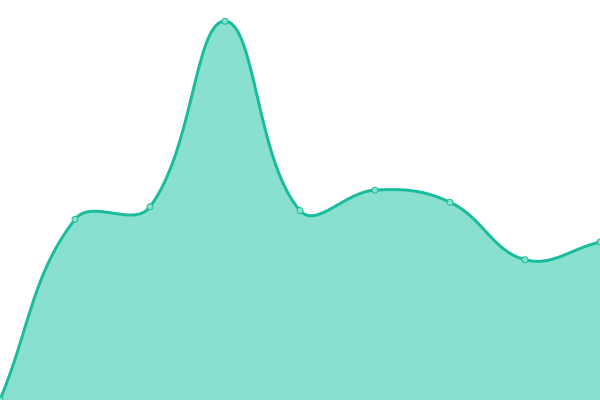

# [📈 Live Status](https://demo.upptime.js.org): <!--live status--> **🟧 Partial outage**

This repository contains the open-source uptime monitor and status page for [BioImage Archive](www.ebi.ac.uk/bioimage-archive), powered by [Upptime](https://github.com/upptime/upptime).

With [Upptime](https://upptime.js.org), you can get your own unlimited and free uptime monitor and status page, powered entirely by a GitHub repository. We use [Issues](https://github.com/BioImage-Archive/upptime/issues) as incident reports, [Actions](https://github.com/BioImage-Archive/upptime/actions) as uptime monitors, and [Pages](https://demo.upptime.js.org) for the status page.

<!--start: status pages-->
<!-- This summary is generated by Upptime (https://github.com/upptime/upptime) -->
<!-- Do not edit this manually, your changes will be overwritten -->
<!-- prettier-ignore -->
| URL | Status | History | Response Time | Uptime |
| --- | ------ | ------- | ------------- | ------ |
|  [BioImage Archive](https://www.ebi.ac.uk/bioimage-archive) | 🟩 Up | [bio-image-archive.yml](https://github.com/BioImage-Archive/upptime/commits/HEAD/history/bio-image-archive.yml) | 

 1542ms
     
 | 

<a href="https://demo.upptime.js.org/history/bio-image-archive">100.00%</a>
    

|  [BioStudies](https://www.ebi.ac.uk/biostudies) | 🟥 Down | [bio-studies.yml](https://github.com/BioImage-Archive/upptime/commits/HEAD/history/bio-studies.yml) | 

 331ms
     
 | 

<a href="https://demo.upptime.js.org/history/bio-studies">76.28%</a>
    

|  [S-BIAD531](https://www.ebi.ac.uk/biostudies/files/S-BIAD531/Zebrafish_ML_Archive/outputs/2020.07.30_FishDev_WT_01_1/obj_probs/FishDev_WT_01_1_MMStack_A10-Site_0.ome_Object%20Probabilities.tiff_results.txt) | 🟥 Down | [s-biad-531.yml](https://github.com/BioImage-Archive/upptime/commits/HEAD/history/s-biad-531.yml) | 

 2508ms
     
 | 

<a href="https://demo.upptime.js.org/history/s-biad-531">75.82%</a>
    

|  [S-BIAD531-TFER-HTTP](https://ftp.ebi.ac.uk/biostudies/fire/S-BIAD/531/S-BIAD531/Files/Zebrafish_ML_Archive/outputs/2020.07.30_FishDev_WT_01_1/obj_probs/FishDev_WT_01_1_MMStack_A10-Site_0.ome_Object%20Probabilities.tiff_results.txt) | 🟩 Up | [s-biad-531-tfer-http.yml](https://github.com/BioImage-Archive/upptime/commits/HEAD/history/s-biad-531-tfer-http.yml) | 

 959ms
     
 | 

<a href="https://demo.upptime.js.org/history/s-biad-531-tfer-http">98.38%</a>
    

<!--end: status pages-->

[**Visit our status website →**](https://demo.upptime.js.org)

## 📄 License

- Powered by: [Upptime](https://github.com/upptime/upptime)
- Code: [MIT](./LICENSE) © [BioImage Archive](www.ebi.ac.uk/bioimage-archive)
- Data in the `./history` directory: [Open Database License](https://opendatacommons.org/licenses/odbl/1-0/)
